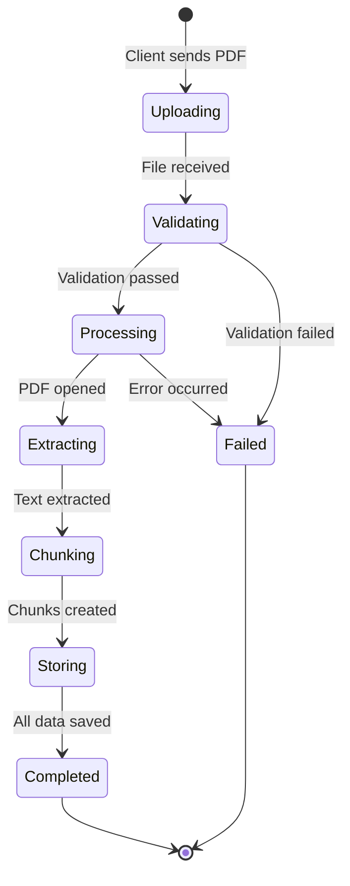

# API Usage Guide

This guide provides practical examples for using the PDF document upload API, including request formats, response handling, and best practices.

## Table of Contents

- [Quick Start](#quick-start)
- [Upload Endpoint](#upload-endpoint)
- [Request Examples](#request-examples)
- [Response Format](#response-format)
- [Error Handling](#error-handling)
- [Processing Workflow](#processing-workflow)
- [File Requirements](#file-requirements)
- [Best Practices](#best-practices)

## Quick Start

### Upload a PDF Document

**Using curl:**

```bash
curl -X POST "http://localhost:8000/api/v1/documents/upload" \
  -H "accept: application/json" \
  -H "Content-Type: multipart/form-data" \
  -F "file=@/path/to/document.pdf" \
  -F "title=My Lecture Notes"
```

**Using Python (requests):**

```python
import requests

url = "http://localhost:8000/api/v1/documents/upload"
files = {"file": open("document.pdf", "rb")}
data = {"title": "My Lecture Notes"}

response = requests.post(url, files=files, data=data)
print(response.json())
```

**Using Python (httpx - async):**

```python
import httpx
import asyncio

async def upload_document():
    async with httpx.AsyncClient() as client:
        files = {"file": open("document.pdf", "rb")}
        data = {"title": "My Lecture Notes"}
        
        response = await client.post(
            "http://localhost:8000/api/v1/documents/upload",
            files=files,
            data=data
        )
        return response.json()

result = asyncio.run(upload_document())
print(result)
```

**Using JavaScript (fetch):**

```javascript
const formData = new FormData();
formData.append('file', fileInput.files[0]);
formData.append('title', 'My Lecture Notes');

fetch('http://localhost:8000/api/v1/documents/upload', {
  method: 'POST',
  body: formData
})
  .then(response => response.json())
  .then(data => console.log(data))
  .catch(error => console.error('Error:', error));
```

## Upload Endpoint

### Endpoint Details

- **URL**: `/api/v1/documents/upload`
- **Method**: `POST`
- **Content-Type**: `multipart/form-data`
- **Authentication**: Not required (future enhancement)

### Request Parameters

| Parameter | Type | Required | Description |
|-----------|------|----------|-------------|
| `file` | File | Yes | PDF file to upload |
| `title` | String | No | Document title (defaults to filename if not provided) |
| `user_id` | Integer | No | User ID for associating document with user |

### Request Constraints

- **File Type**: Must be `application/pdf`
- **File Size**: Maximum 50MB (52,428,800 bytes)
- **File Content**: Must be a valid, non-encrypted PDF

## Request Examples

### Basic Upload

Upload a PDF with automatic title (uses filename):

```bash
curl -X POST "http://localhost:8000/api/v1/documents/upload" \
  -F "file=@lecture_notes.pdf"
```

### Upload with Custom Title

```bash
curl -X POST "http://localhost:8000/api/v1/documents/upload" \
  -F "file=@document.pdf" \
  -F "title=Introduction to Machine Learning"
```

### Upload with User Association

```bash
curl -X POST "http://localhost:8000/api/v1/documents/upload" \
  -F "file=@notes.pdf" \
  -F "title=CS101 Lecture 5" \
  -F "user_id=123"
```

### Python Example with Error Handling

```python
import requests
from pathlib import Path

def upload_pdf(file_path: str, title: str = None, user_id: int = None):
    """
    Upload a PDF document to the API.
    
    Args:
        file_path: Path to the PDF file
        title: Optional document title
        user_id: Optional user ID
        
    Returns:
        dict: Response data with document metadata
        
    Raises:
        requests.HTTPError: If upload fails
    """
    url = "http://localhost:8000/api/v1/documents/upload"
    
    # Validate file exists
    if not Path(file_path).exists():
        raise FileNotFoundError(f"File not found: {file_path}")
    
    # Prepare request
    files = {"file": open(file_path, "rb")}
    data = {}
    
    if title:
        data["title"] = title
    if user_id:
        data["user_id"] = user_id
    
    try:
        # Make request
        response = requests.post(url, files=files, data=data)
        response.raise_for_status()  # Raise exception for 4xx/5xx
        
        return response.json()
        
    except requests.HTTPError as e:
        print(f"Upload failed: {e}")
        print(f"Response: {e.response.text}")
        raise
    finally:
        files["file"].close()

# Usage
try:
    result = upload_pdf(
        file_path="lecture_notes.pdf",
        title="Machine Learning Basics",
        user_id=42
    )
    print(f"Document uploaded successfully!")
    print(f"Document ID: {result['id']}")
    print(f"Chunks created: {result['chunk_count']}")
except Exception as e:
    print(f"Error: {e}")
```

### Batch Upload Example

```python
import requests
from pathlib import Path
from concurrent.futures import ThreadPoolExecutor, as_completed

def upload_single_file(file_path: Path) -> dict:
    """Upload a single PDF file."""
    url = "http://localhost:8000/api/v1/documents/upload"
    
    with open(file_path, "rb") as f:
        files = {"file": f}
        data = {"title": file_path.stem}  # Use filename without extension
        
        response = requests.post(url, files=files, data=data)
        response.raise_for_status()
        return response.json()

def batch_upload(directory: str, max_workers: int = 5):
    """
    Upload all PDF files in a directory concurrently.
    
    Args:
        directory: Path to directory containing PDFs
        max_workers: Maximum number of concurrent uploads
    """
    pdf_files = list(Path(directory).glob("*.pdf"))
    
    print(f"Found {len(pdf_files)} PDF files to upload")
    
    results = []
    with ThreadPoolExecutor(max_workers=max_workers) as executor:
        # Submit all upload tasks
        future_to_file = {
            executor.submit(upload_single_file, pdf): pdf 
            for pdf in pdf_files
        }
        
        # Process completed uploads
        for future in as_completed(future_to_file):
            pdf_file = future_to_file[future]
            try:
                result = future.result()
                print(f"✓ Uploaded: {pdf_file.name} (ID: {result['id']})")
                results.append(result)
            except Exception as e:
                print(f"✗ Failed: {pdf_file.name} - {e}")
    
    print(f"\nCompleted: {len(results)}/{len(pdf_files)} uploads successful")
    return results

# Usage
batch_upload("./lecture_pdfs", max_workers=10)
```

## Response Format

### Success Response (201 Created)

```json
{
  "id": 42,
  "title": "Introduction to Machine Learning",
  "original_filename": "ml_lecture_01.pdf",
  "file_size": 2457600,
  "mime_type": "application/pdf",
  "processing_status": "completed",
  "page_count": 25,
  "chunk_count": 18,
  "uploaded_at": "2024-12-25T06:00:00Z"
}
```

**Response Fields:**

| Field | Type | Description |
|-------|------|-------------|
| `id` | Integer | Unique document identifier |
| `title` | String | Document title |
| `original_filename` | String | Original filename from upload |
| `file_size` | Integer | File size in bytes |
| `mime_type` | String | MIME type (always `application/pdf`) |
| `processing_status` | String | Processing status (`completed`, `failed`, `pending`) |
| `page_count` | Integer | Number of pages in PDF |
| `chunk_count` | Integer | Number of text chunks created |
| `uploaded_at` | String | ISO 8601 timestamp of upload |

### Error Responses

#### 400 Bad Request - Invalid File Type

```json
{
  "detail": "Invalid file type. Allowed types: application/pdf"
}
```

#### 400 Bad Request - PDF Validation Failed

```json
{
  "detail": "PDF validation failed: File is encrypted and cannot be processed"
}
```

#### 413 Content Too Large

```json
{
  "detail": "File size exceeds maximum allowed size of 50MB"
}
```

#### 422 Unprocessable Entity - Invalid User ID

```json
{
  "detail": "Invalid user_id: user does not exist"
}
```

#### 500 Internal Server Error

```json
{
  "detail": "PDF processing failed: Text extraction error"
}
```

## Error Handling

### Common Error Scenarios

#### 1. File Too Large

```python
try:
    result = upload_pdf("large_file.pdf")
except requests.HTTPError as e:
    if e.response.status_code == 413:
        print("File is too large. Maximum size is 50MB.")
        print("Consider splitting the PDF or compressing it.")
```

#### 2. Invalid File Type

```python
try:
    result = upload_pdf("document.docx")  # Wrong file type
except requests.HTTPError as e:
    if e.response.status_code == 400:
        error_detail = e.response.json().get("detail", "")
        if "Invalid file type" in error_detail:
            print("Only PDF files are supported.")
```

#### 3. Encrypted PDF

```python
try:
    result = upload_pdf("encrypted.pdf")
except requests.HTTPError as e:
    if e.response.status_code == 400:
        error_detail = e.response.json().get("detail", "")
        if "encrypted" in error_detail.lower():
            print("PDF is encrypted. Please remove encryption first.")
```

#### 4. Network Timeout

```python
import requests

try:
    response = requests.post(
        url,
        files=files,
        data=data,
        timeout=30  # 30 second timeout
    )
except requests.Timeout:
    print("Upload timed out. The file may be too large or network is slow.")
    print("Try again or use a smaller file.")
```

### Retry Strategy

For transient errors (network issues, temporary server problems):

```python
import time
from requests.exceptions import RequestException

def upload_with_retry(file_path: str, max_retries: int = 3, backoff: float = 2.0):
    """
    Upload with exponential backoff retry.
    
    Args:
        file_path: Path to PDF file
        max_retries: Maximum number of retry attempts
        backoff: Backoff multiplier (seconds)
    """
    for attempt in range(max_retries):
        try:
            return upload_pdf(file_path)
        except RequestException as e:
            if attempt == max_retries - 1:
                raise  # Last attempt, re-raise exception
            
            wait_time = backoff ** attempt
            print(f"Attempt {attempt + 1} failed. Retrying in {wait_time}s...")
            time.sleep(wait_time)
```

## Processing Workflow

### Upload Lifecycle



### Processing Steps

1. **Upload** (Client → Server)
   - File transmitted via multipart form data
   - Server receives and buffers file

2. **Validation** (< 100ms)
   - Content type verification
   - File size check
   - Magic byte validation
   - PDF integrity check

3. **Text Extraction** (200-500ms for 20-page PDF)
   - Page-by-page text extraction
   - Structure preservation
   - Text preprocessing

4. **File Storage** (20-50ms)
   - Generate unique UUID
   - Save to disk

5. **Text Chunking** (100-300ms)
   - Sentence boundary detection
   - Chunk creation with overlap
   - Metadata generation

6. **Database Storage** (50-100ms)
   - Create document record
   - Insert chunk records
   - Update status to `completed`

**Total Time**: Typically 0.4-1.1 seconds for a 20-page PDF

### Status Field Values

| Status | Description |
|--------|-------------|
| `pending` | Document uploaded, processing not started |
| `processing` | Currently being processed (future use) |
| `completed` | Successfully processed and ready |
| `failed` | Processing failed (check error message) |

## File Requirements

### Supported Formats

- **PDF Version**: 1.0 through 2.0
- **Encoding**: UTF-8, Latin-1, and other standard encodings
- **Layout**: Single column, multi-column, mixed layouts
- **Content**: Text-based PDFs (not scanned images)

### File Size Limits

- **Minimum**: 1 KB (non-empty file)
- **Maximum**: 50 MB (52,428,800 bytes)
- **Recommended**: Under 10 MB for optimal performance

### Unsupported PDFs

❌ **Encrypted PDFs**: Password-protected or encrypted files  
❌ **Scanned Images**: PDFs containing only images without OCR  
❌ **Corrupted Files**: Damaged or incomplete PDF files  
❌ **Non-PDF Files**: Files with `.pdf` extension but not actual PDFs

### PDF Preparation Tips

1. **Remove Encryption**: Use PDF tools to remove passwords
2. **Optimize Size**: Compress large PDFs before uploading
3. **OCR Scanned Documents**: Convert image-only PDFs to searchable text
4. **Repair Corrupted Files**: Use PDF repair tools if upload fails

## Best Practices

### 1. File Size Optimization

```bash
# Compress PDF using Ghostscript
gs -sDEVICE=pdfwrite -dCompatibilityLevel=1.4 -dPDFSETTINGS=/ebook \
   -dNOPAUSE -dQUIET -dBATCH \
   -sOutputFile=compressed.pdf input.pdf
```

### 2. Validate Before Upload

```python
import PyPDF2

def validate_pdf_before_upload(file_path: str) -> bool:
    """
    Validate PDF file before uploading.
    
    Returns:
        bool: True if PDF is valid and ready for upload
    """
    try:
        with open(file_path, 'rb') as f:
            # Check file size
            f.seek(0, 2)  # Seek to end
            size = f.tell()
            if size > 50 * 1024 * 1024:
                print(f"File too large: {size / 1024 / 1024:.1f}MB (max 50MB)")
                return False
            
            # Check if valid PDF
            f.seek(0)
            pdf = PyPDF2.PdfReader(f)
            
            # Check if encrypted
            if pdf.is_encrypted:
                print("PDF is encrypted")
                return False
            
            # Check page count
            page_count = len(pdf.pages)
            print(f"PDF has {page_count} pages")
            
            return True
            
    except Exception as e:
        print(f"PDF validation failed: {e}")
        return False
```

### 3. Concurrent Upload Limits

- **Recommended**: 5-10 concurrent uploads
- **Maximum**: 20 concurrent uploads
- **Reason**: Database connection pool and server resource limits

```python
# Good: Limited concurrency
with ThreadPoolExecutor(max_workers=10) as executor:
    futures = [executor.submit(upload_pdf, f) for f in files]

# Bad: Unlimited concurrency (may overwhelm server)
with ThreadPoolExecutor(max_workers=100) as executor:  # Too many!
    futures = [executor.submit(upload_pdf, f) for f in files]
```

### 4. Progress Tracking

```python
from tqdm import tqdm

def upload_with_progress(files: list):
    """Upload multiple files with progress bar."""
    results = []
    
    with tqdm(total=len(files), desc="Uploading PDFs") as pbar:
        for file_path in files:
            try:
                result = upload_pdf(file_path)
                results.append(result)
                pbar.set_postfix({"status": "✓", "file": Path(file_path).name})
            except Exception as e:
                pbar.set_postfix({"status": "✗", "error": str(e)[:30]})
            finally:
                pbar.update(1)
    
    return results
```

### 5. Logging and Monitoring

```python
import logging

logging.basicConfig(level=logging.INFO)
logger = logging.getLogger(__name__)

def upload_with_logging(file_path: str):
    """Upload with comprehensive logging."""
    logger.info(f"Starting upload: {file_path}")
    
    try:
        start_time = time.time()
        result = upload_pdf(file_path)
        duration = time.time() - start_time
        
        logger.info(
            f"Upload successful: {file_path} "
            f"(ID: {result['id']}, Duration: {duration:.2f}s)"
        )
        return result
        
    except Exception as e:
        logger.error(f"Upload failed: {file_path} - {e}", exc_info=True)
        raise
```

## Interactive API Documentation

For interactive API testing and complete endpoint documentation:

- **Swagger UI**: [http://localhost:8000/docs](http://localhost:8000/docs)
- **ReDoc**: [http://localhost:8000/redoc](http://localhost:8000/redoc)

---

## Related Documentation

- [Technical Documentation](PDF_PROCESSING.md) - Architecture and implementation details
- [Performance Benchmarks](PERFORMANCE.md) - Processing speed and resource usage
- [Troubleshooting Guide](TROUBLESHOOTING.md) - Common issues and solutions
- [Testing Guide](TESTING.md) - Testing strategy and procedures
