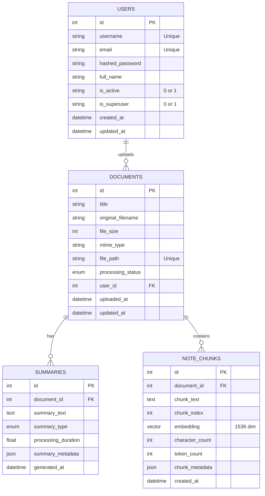

# Database Schema Documentation

This document provides a detailed overview of the database schema for the AI Lecture Note Summarizer application. The system uses PostgreSQL with the `pgvector` extension for handling high-dimensional vector embeddings.

## Entity-Relationship Diagram



## Tables

### Users (`users`)

Stores user authentication and profile information.

- **id**: Primary Key. Auto-incrementing integer.
- **username**: Unique string (50 chars). User's login identifier.
- **email**: Unique string (255 chars). User's email address.
- **hashed_password**: Bcrypt hashed password string.
- **is_active**: String flag ('0' or '1') indicating account status.
- **is_superuser**: String flag ('0' or '1') for admin privileges.
- **created_at**: Timestamp of account creation.
- **updated_at**: Timestamp of last profile update.

### Documents (`documents`)

Metadata for uploaded files and their processing status.

- **id**: Primary Key.
- **user_id**: Foreign Key referencing `users.id` (ON DELETE CASCADE).
- **title**: Document title.
- **file_path**: Unique storage path/key for the file.
- **processing_status**: ENUM (`pending`, `processing`, `completed`, `failed`).
- **uploaded_at**: Upload timestamp.
- **original_filename**: Original name of the uploaded document.
- **file_size**: Size of the file in bytes.
- **mime_type**: MIME type of the file.
- **page_count**: Number of pages in the PDF document.
- **error_message**: Error message if processing failed.

### Summaries (`summaries`)

AI-generated summaries of documents.

- **id**: Primary Key.
- **document_id**: Foreign Key referencing `documents.id` (ON DELETE CASCADE).
- **summary_text**: The content of the generated summary.
- **summary_type**: ENUM (`extractive`, `abstractive`).
- **summary_metadata**: JSON field for flexible metadata storage (e.g., model used).

### Note Chunks (`note_chunks`)

Text segments extracted from documents, enriched with vector embeddings.

- **id**: Primary Key.
- **document_id**: Foreign Key referencing `documents.id` (ON DELETE CASCADE).
- **chunk_index**: Integer indicating the order of the chunk in the document.
- **chunk_text**: The actual text content.
- **embedding**: `vector(1536)` column for storing OpenAI-compatible embeddings.
- **token_count**: Integer count of tokens in the chunk.

## Indexing Strategy

### Standard Indexes

- **B-Tree Indexes**: Applied to foreign keys (`user_id`, `document_id`) used in joins.
- **Unique Indexes**: Enforced on `username`, `email`, and `file_path`.
- **Composite Indexes**:
  - `ix_documents_user_status` (`user_id`, `processing_status`) for filtering user documents by status.
  - `ix_note_chunks_document_index` (`document_id`, `chunk_index`) for retrieving document chunks in order.

### Vector Search Indexing

- **HNSW Index**: The `embedding` column in `note_chunks` is optimized using Hierarchical Navigable Small World (HNSW) graphs. This allows for approximate nearest neighbor search which is significantly faster than exact search for high-dimensional vectors.
  - *Metric*: Cosine distance (default for text embeddings).

## Migration Workflow

We use **Alembic** for handling database schema changes.

1. **Modify Models**: Update SQLAlchemy models in `backend/app/models/`.
2. **Generate Migration**:

    ```bash
    alembic revision --autogenerate -m "describe_changes"
    ```

3. **Review Script**: Check the generated file in `backend/app/alembic/versions/`.
4. **Apply Migration**:

    ```bash
    alembic upgrade head
    ```
