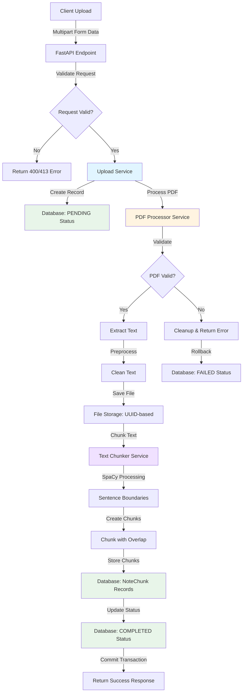
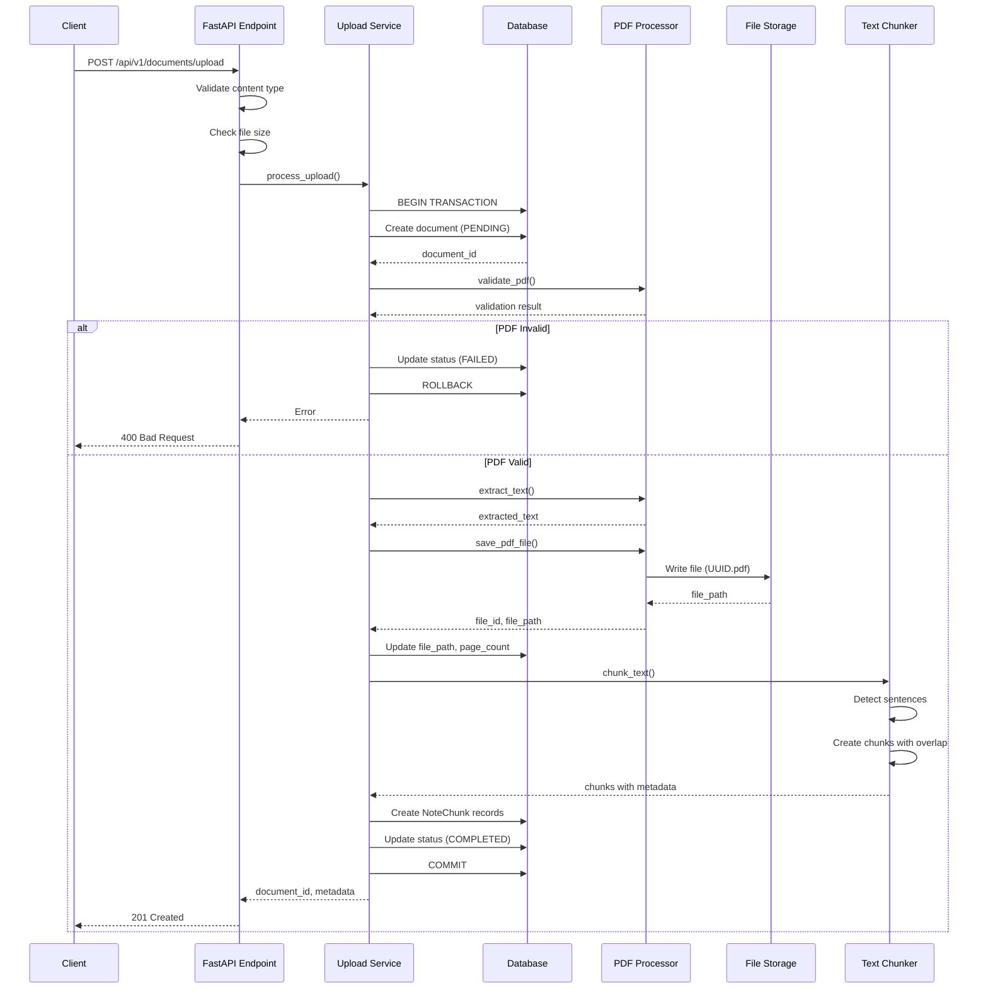
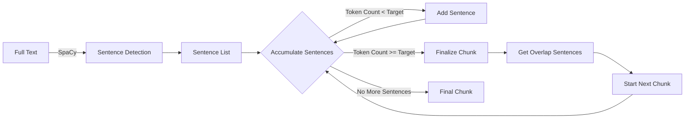
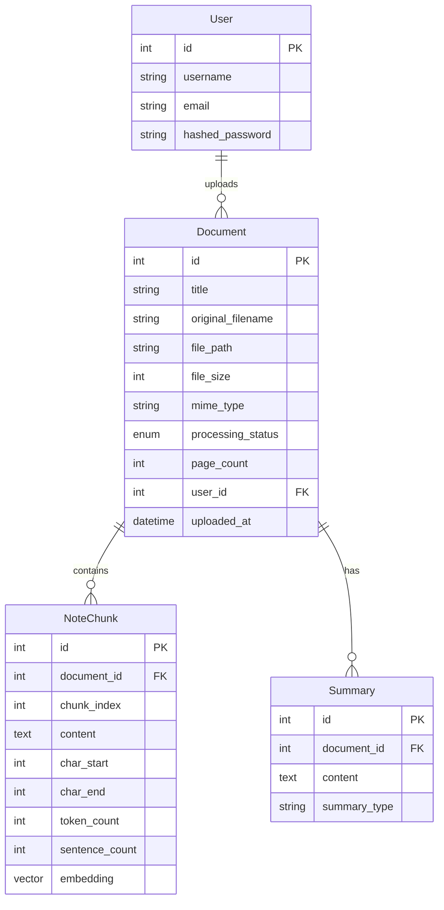

# PDF Processing Pipeline - Technical Documentation

This document provides comprehensive technical documentation for the PDF processing pipeline, covering architecture, algorithms, and implementation details.

## Table of Contents

- [Architecture Overview](#architecture-overview)
- [Processing Workflow](#processing-workflow)
- [Text Extraction Methodology](#text-extraction-methodology)
- [Chunking Algorithm](#chunking-algorithm)
- [File Storage](#file-storage)
- [Database Schema](#database-schema)
- [Transaction Management](#transaction-management)
- [Error Handling](#error-handling)
- [Performance Considerations](#performance-considerations)

## Architecture Overview

The PDF processing pipeline is built on a modular, service-oriented architecture with clear separation of concerns:



### Core Components

#### 1. Upload Service (`upload_service.py`)

**Purpose**: Orchestrates the complete document upload workflow with transaction management.

**Responsibilities**:

- Create initial document record with `PENDING` status
- Coordinate PDF processing and text chunking
- Manage database transactions (commit on success, rollback on failure)
- Handle cleanup of files and database records on errors
- Update document status throughout the workflow

**Key Design Decisions**:

- **Transaction Boundaries**: Each upload is a single database transaction to ensure atomicity
- **Cleanup Strategy**: On failure, the service deletes uploaded files and rolls back database changes
- **Status Tracking**: Document status transitions: `PENDING` → `COMPLETED` or `FAILED`

#### 2. PDF Processor Service (`pdf_processor.py`)

**Purpose**: Validates, extracts text from, and stores PDF files.

**Responsibilities**:

- Validate PDF magic bytes (file signature verification)
- Check file size limits (configurable, default 50MB)
- Verify PDF integrity and detect encryption
- Extract text with structure preservation
- Preprocess text to remove artifacts
- Generate unique file paths and save files

**Key Design Decisions**:

- **PyMuPDF (fitz)**: Chosen for robust text extraction and structure preservation
- **Magic Byte Validation**: Prevents non-PDF files from being processed
- **Encryption Detection**: Rejects encrypted PDFs that cannot be processed
- **UUID-based Naming**: Prevents filename collisions and path traversal attacks

#### 3. Text Chunker Service (`text_chunker.py`)

**Purpose**: Intelligently segments text into chunks optimized for semantic search.

**Responsibilities**:

- Load and cache SpaCy language model
- Detect sentence boundaries accurately
- Create chunks with configurable size and overlap
- Handle edge cases (long sentences, short documents)
- Generate metadata for each chunk

**Key Design Decisions**:

- **SpaCy for Sentence Detection**: More accurate than regex-based approaches
- **Sentence-Boundary Awareness**: Never breaks chunks mid-sentence
- **Configurable Overlap**: Ensures context continuity between chunks
- **Model Caching**: SpaCy model loaded once and reused for performance

## Processing Workflow

### Step-by-Step Upload Process



### Processing Timeline

For a typical 20-page PDF document:

1. **Request Validation** (< 10ms)
   - Content type check
   - File size validation
   - Form data parsing

2. **Database Record Creation** (10-20ms)
   - Create document with `PENDING` status
   - Generate database ID

3. **PDF Validation** (50-100ms)
   - Magic byte verification
   - PDF integrity check
   - Encryption detection

4. **Text Extraction** (200-500ms)
   - Page-by-page text extraction
   - Structure preservation
   - Text preprocessing

5. **File Storage** (20-50ms)
   - UUID generation
   - File write to disk

6. **Text Chunking** (100-300ms)
   - SpaCy model loading (cached after first use)
   - Sentence boundary detection
   - Chunk creation with overlap

7. **Database Storage** (50-100ms)
   - Bulk insert of NoteChunk records
   - Document metadata update
   - Status update to `COMPLETED`

**Total Processing Time**: ~430-1,080ms (0.4-1.1 seconds) for a 20-page PDF

## Text Extraction Methodology

### PyMuPDF (fitz) Implementation

The PDF processor uses PyMuPDF for text extraction due to its:

- **Accuracy**: Better text extraction than alternatives (pdfminer, PyPDF2)
- **Structure Preservation**: Maintains paragraph breaks and formatting
- **Performance**: Fast C-based implementation
- **Robustness**: Handles various PDF formats and encodings

### Extraction Process

```python
def extract_text_from_pdf(self, doc: fitz.Document) -> str:
    """
    Extract text from PDF while preserving document structure.
    
    Process:
    1. Iterate through each page
    2. Extract text blocks with layout information
    3. Preserve paragraph boundaries
    4. Handle multi-column layouts
    5. Clean and normalize text
    """
```

**Key Features**:

1. **Page-by-Page Processing**: Each page is processed independently to manage memory
2. **Block-Level Extraction**: Uses `get_text("blocks")` for better structure preservation
3. **Paragraph Detection**: Identifies paragraph boundaries using spacing and formatting
4. **Multi-Column Support**: Handles complex layouts with multiple columns
5. **Encoding Handling**: Properly decodes various text encodings

### Text Preprocessing

After extraction, text undergoes preprocessing to remove common PDF artifacts:

```python
# Remove excessive whitespace
text = re.sub(r'\s+', ' ', text)

# Remove page numbers (common patterns)
text = re.sub(r'^\s*\d+\s*$', '', text, flags=re.MULTILINE)

# Remove headers/footers (repeated patterns)
# Normalize unicode characters
# Remove hyphenation artifacts
```

**Preprocessing Steps**:

1. **Whitespace Normalization**: Collapse multiple spaces, tabs, newlines
2. **Page Number Removal**: Detect and remove standalone page numbers
3. **Header/Footer Removal**: Identify repeated text across pages
4. **Hyphenation Repair**: Rejoin words split across lines
5. **Unicode Normalization**: Convert to consistent unicode form
6. **Special Character Handling**: Preserve meaningful punctuation

## Chunking Algorithm

### SpaCy-Based Sentence Detection

The text chunker uses SpaCy's `en_core_web_sm` model for accurate sentence boundary detection:

```python
# Load SpaCy model (cached at class level)
nlp = spacy.load("en_core_web_sm", disable=["ner", "parser", "lemmatizer"])

# Process text
doc = nlp(text)

# Extract sentences
sentences = [(sent.text, sent.start_char, sent.end_char) for sent in doc.sents]
```

**Why SpaCy?**

- **Accuracy**: Machine learning-based, handles edge cases better than regex
- **Context-Aware**: Understands abbreviations (Dr., Mr., etc.)
- **Performance**: Optimized pipeline with disabled unnecessary components
- **Reliability**: Handles various text formats and styles

### Chunking Strategy

The chunking algorithm creates overlapping chunks that respect sentence boundaries:



**Algorithm Details**:

1. **Configuration** (default values):
   - `target_size`: 512 tokens per chunk
   - `overlap`: 50 tokens between chunks
   - `min_chunk_size`: 100 tokens minimum

2. **Chunk Creation**:

   ```
   For each sentence:
     - Add sentence to current chunk
     - Count tokens in chunk
     - If chunk >= target_size:
       * Finalize chunk
       * Get last N sentences for overlap
       * Start new chunk with overlap sentences
   ```

3. **Overlap Calculation**:

   ```python
   # Get sentences from end of chunk for overlap
   overlap_sentences = []
   overlap_tokens = 0
   
   for sentence in reversed(current_chunk_sentences):
       if overlap_tokens + sentence_tokens <= config.overlap:
           overlap_sentences.insert(0, sentence)
           overlap_tokens += sentence_tokens
       else:
           break
   ```

4. **Edge Case Handling**:
   - **Long Sentences**: Sentences exceeding target size are split at token boundaries
   - **Short Documents**: Documents smaller than min_chunk_size create a single chunk
   - **Last Chunk**: May be smaller than target size to include all remaining text

### Chunk Metadata

Each chunk includes comprehensive metadata:

```python
@dataclass
class ChunkMetadata:
    index: int              # Position in document (0-indexed)
    char_start: int         # Starting character offset
    char_end: int           # Ending character offset
    token_count: int        # Number of tokens in chunk
    sentence_count: int     # Number of complete sentences
    parent_doc_id: str      # Reference to parent document
```

**Metadata Usage**:

- **Reconstruction**: Character offsets allow exact text reconstruction
- **Context**: Sentence count helps understand chunk granularity
- **Ordering**: Index maintains document structure
- **Traceability**: Parent document ID links chunks to source

## File Storage

### Storage Structure

```
uploads/
├── 0003eb5f-531d-4f20-97f0-d058aa6102bb.pdf
├── 000c3de2-2802-4c0d-aa26-3ec84995a81a.pdf
├── 003bbab1-61eb-4d9e-b006-44535151a0ab.pdf
└── ...
```

**Design Principles**:

1. **UUID-based Naming**: Each file gets a unique identifier
   - Prevents filename collisions
   - Eliminates path traversal vulnerabilities
   - Enables easy file management

2. **Flat Directory Structure**: All files in single directory
   - Simplifies file operations
   - Avoids nested directory complexity
   - Suitable for moderate file volumes (< 100,000 files)

3. **Extension Preservation**: Original `.pdf` extension maintained
   - Enables MIME type detection
   - Simplifies file type validation
   - Maintains compatibility with tools

### File Path Generation

```python
def generate_file_path(self, original_filename: str) -> Path:
    """
    Generate unique file path for storing PDF.
    
    Format: {upload_dir}/{uuid}.pdf
    Example: uploads/0003eb5f-531d-4f20-97f0-d058aa6102bb.pdf
    """
    file_id = str(uuid.uuid4())
    # Extract extension, default to .pdf
    extension = Path(original_filename).suffix or '.pdf'
    filename = f"{file_id}{extension}"
    return self.upload_dir / filename
```

### Storage Configuration

Configurable via environment variables:

```bash
# Upload directory (default: uploads)
UPLOAD_DIR=uploads

# Maximum file size in bytes (default: 50MB)
MAX_UPLOAD_SIZE=52428800
```

## Database Schema

### Document Model

```python
class Document(BaseModel):
    id: int (Primary Key)
    title: str (max 255 chars)
    original_filename: str (max 255 chars)
    file_path: str (nullable, max 500 chars)
    file_size: int (bytes)
    mime_type: str (max 100 chars)
    processing_status: ProcessingStatus (ENUM)
    page_count: int (nullable)
    user_id: int (Foreign Key, nullable)
    uploaded_at: datetime
    created_at: datetime
    updated_at: datetime
```

**Processing Status Values**:

- `PENDING`: Upload received, processing not started
- `PROCESSING`: Currently being processed (future use)
- `COMPLETED`: Successfully processed
- `FAILED`: Processing failed with error

### NoteChunk Model

```python
class NoteChunk(BaseModel):
    id: int (Primary Key)
    document_id: int (Foreign Key, NOT NULL)
    chunk_index: int (0-based position)
    content: text (chunk text)
    char_start: int (character offset)
    char_end: int (character offset)
    token_count: int
    sentence_count: int
    embedding: Vector(1536) (nullable, for future use)
    created_at: datetime
    updated_at: datetime
```

**Indexes**:

- Primary key on `id`
- Foreign key on `document_id` with CASCADE delete
- Composite index on `(document_id, chunk_index)` for ordered retrieval
- HNSW index on `embedding` for vector similarity search (future use)

### Relationships



**Cascade Behavior**:

- Deleting a `Document` cascades to delete all associated `NoteChunk` records
- Deleting a `Document` cascades to delete all associated `Summary` records
- Deleting a `User` sets `user_id` to NULL in associated documents (nullable FK)

## Transaction Management

### Transaction Boundaries

Each document upload is wrapped in a single database transaction:

```python
def process_upload(self, db: Session, ...):
    document_id = None
    file_path = None
    
    try:
        # All operations within one transaction
        document_id = self._create_initial_document(db, ...)
        file_id, text, file_path, page_count = self._process_pdf(...)
        self._update_document_metadata(db, document_id, file_path, page_count)
        chunk_count = self._chunk_and_store(db, document_id, text)
        self._update_document_status(db, document_id, ProcessingStatus.COMPLETED)
        
        # Commit all changes atomically
        db.commit()
        return document_id, {"chunk_count": chunk_count}
        
    except Exception as e:
        # Rollback all database changes
        self._cleanup_on_failure(db, document_id, file_path, str(e))
        raise
```

**Atomicity Guarantees**:

1. **All-or-Nothing**: Either the entire upload succeeds or nothing is persisted
2. **Consistency**: Database remains in valid state even on failure
3. **Isolation**: Concurrent uploads don't interfere with each other
4. **Durability**: Committed uploads are permanently stored

### Cleanup on Failure

When an error occurs, the system performs comprehensive cleanup:

```python
def _cleanup_on_failure(self, db, document_id, file_path, error_message):
    """
    Cleanup steps:
    1. Update document status to FAILED (if document exists)
    2. Rollback database transaction
    3. Delete uploaded file from storage (if exists)
    """
    try:
        if document_id:
            # Update status to FAILED with error message
            db.query(Document).filter(Document.id == document_id).update({
                "processing_status": ProcessingStatus.FAILED,
                "error_message": error_message
            })
        
        # Rollback transaction
        db.rollback()
        
        # Delete file if it was saved
        if file_path and file_path.exists():
            file_path.unlink()
            
    except Exception as cleanup_error:
        logger.error(f"Cleanup failed: {cleanup_error}")
```

## Error Handling

### Error Categories

1. **Validation Errors** (`PDFValidationError`):
   - Invalid file type (not a PDF)
   - File size exceeds limit
   - Corrupted PDF
   - Encrypted PDF
   - Empty PDF

2. **Processing Errors** (`PDFProcessingError`):
   - Text extraction failure
   - File storage failure
   - Directory creation failure

3. **Chunking Errors** (`TextChunkerError`):
   - Empty text input
   - SpaCy model loading failure
   - Sentence detection failure

4. **Service Errors** (`UploadServiceError`):
   - Database transaction failure
   - Foreign key violation
   - Unique constraint violation

### Error Response Format

```json
{
  "detail": "PDF validation failed: File is encrypted and cannot be processed"
}
```

**HTTP Status Codes**:

- `400 Bad Request`: Validation errors, invalid input
- `413 Content Too Large`: File size exceeds limit
- `422 Unprocessable Entity`: Semantic validation errors
- `500 Internal Server Error`: Processing failures, unexpected errors

## Performance Considerations

### Optimization Strategies

1. **SpaCy Model Caching**:
   - Model loaded once at class level
   - Reused across all chunking operations
   - Reduces overhead from ~500ms to ~0ms per request

2. **Disabled Pipeline Components**:

   ```python
   nlp = spacy.load("en_core_web_sm", 
                    disable=["ner", "parser", "lemmatizer"])
   ```

   - Only sentence detection enabled
   - Reduces processing time by ~60%

3. **Bulk Database Operations**:
   - Chunks inserted in batch, not individually
   - Reduces database round trips
   - ~10x faster than individual inserts

4. **Streaming File Writes**:
   - Files written directly to disk
   - No intermediate buffering in memory
   - Supports large files without memory issues

### Memory Management

1. **Page-by-Page Processing**: PDF pages processed sequentially, not all at once
2. **Text Cleanup**: Extracted text cleaned and released from memory
3. **Document Closure**: PyMuPDF documents explicitly closed after processing
4. **No Global State**: Services are stateless (except cached SpaCy model)

### Scalability Limits

**Current Configuration**:

- Maximum file size: 50MB
- Maximum concurrent uploads: Limited by database connection pool (default: 20)
- Storage capacity: Limited by disk space
- Processing time: ~0.4-1.1 seconds per 20-page PDF

**Recommended Limits**:

- Concurrent uploads: 10-20 simultaneous requests
- File size: Keep under 50MB for optimal performance
- Document volume: Suitable for 10,000+ documents

**Future Optimizations**:

- Async processing with background workers (Celery, RQ)
- Distributed file storage (S3, MinIO)
- Caching layer (Redis) for frequently accessed chunks
- Horizontal scaling with load balancer

---

## Related Documentation

- [API Usage Guide](API_USAGE.md) - How to use the upload API
- [Performance Benchmarks](PERFORMANCE.md) - Detailed performance metrics
- [Troubleshooting Guide](TROUBLESHOOTING.md) - Common issues and solutions
- [Database Schema](DATABASE_SCHEMA.md) - Complete database documentation
- [Testing Guide](TESTING.md) - Testing strategy and procedures
